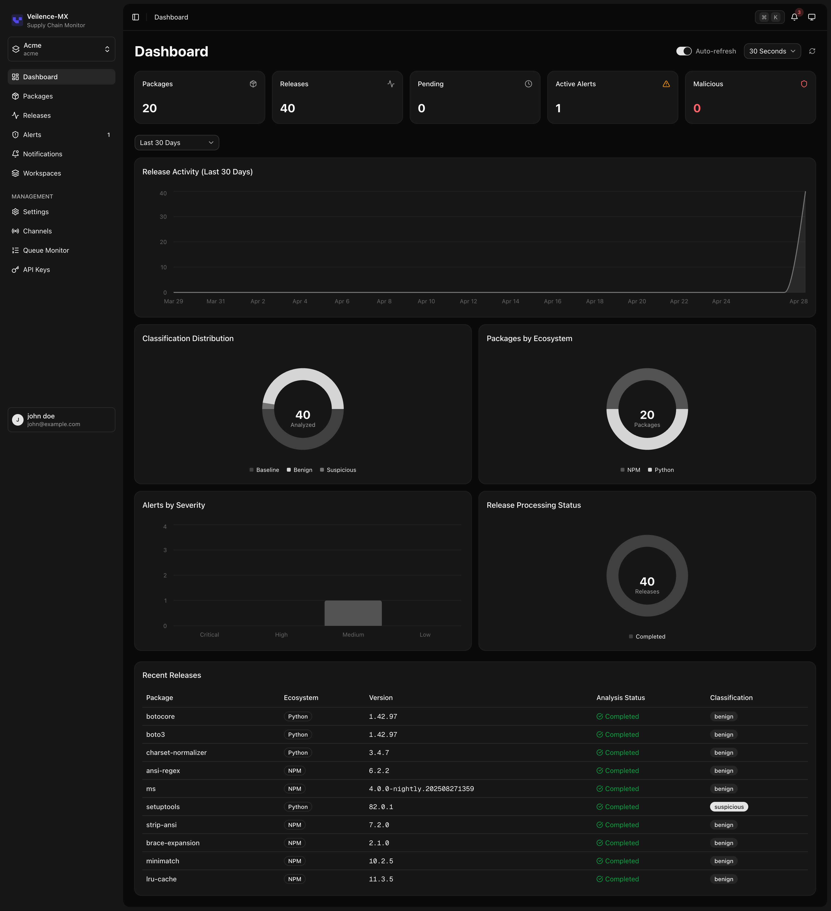
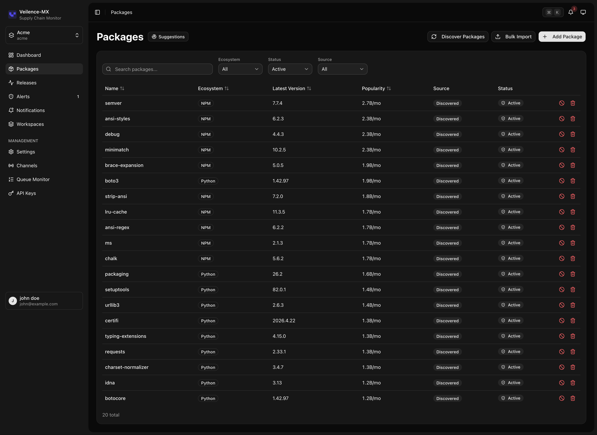
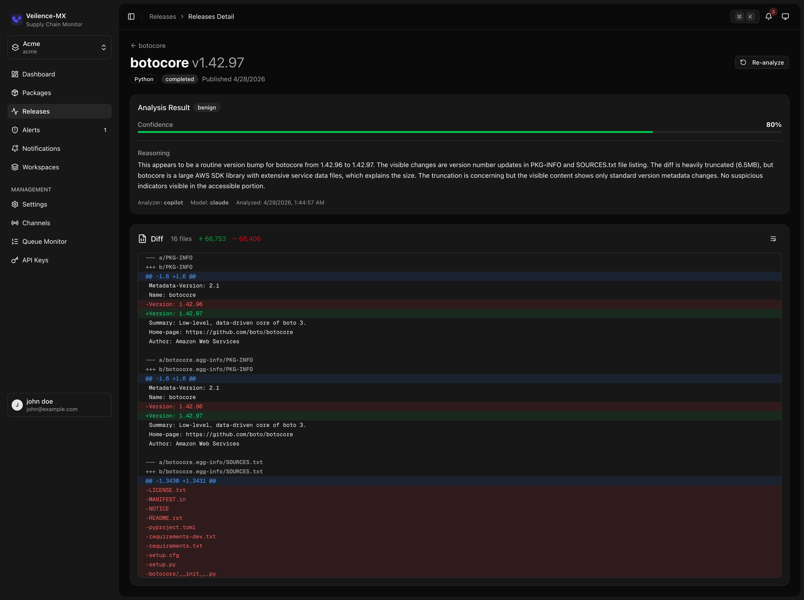
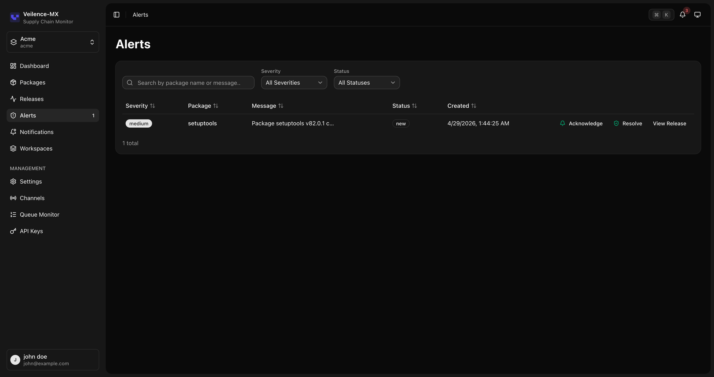
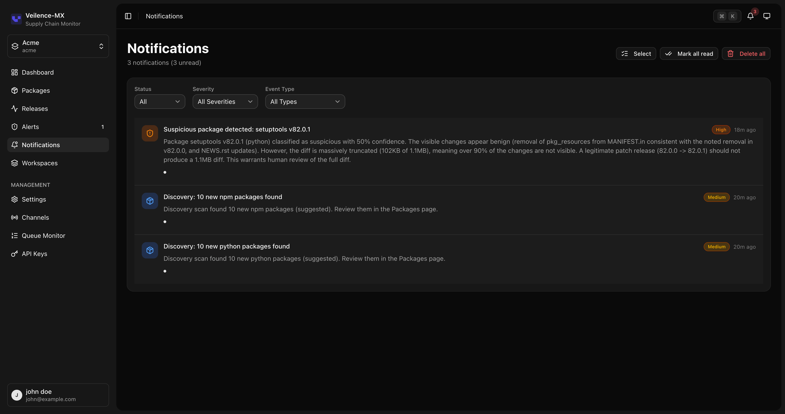
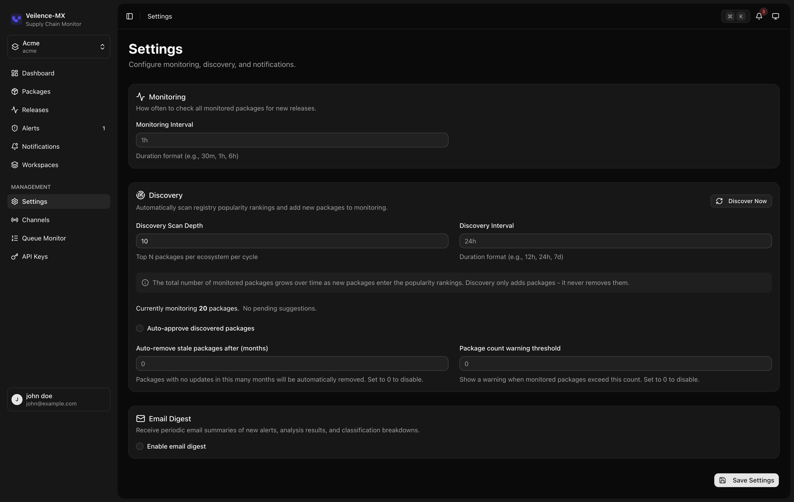

# Veilence-MX

Real-time supply chain monitoring for Python and NPM ecosystems with LLM-powered diff analysis.

## Overview

Veilence-MX watches package ecosystems for new releases, generates diffs between versions, and uses LLMs to classify code changes as benign, suspicious, or malicious. Threats are surfaced through an alert management dashboard for security team triage.

Packages are monitored in two modes: Top-N (automatically tracks the most popular packages by downloads) and Manual (user-specified packages).

## Screenshots

| | | |
|---|---|---|
|  |  |  |
| Dashboard | Packages | Release Analysis |
|  |  |  |
| Alerts | Notifications | Settings |

## Features

### Package Monitoring
- ✅ Python and NPM ecosystem support
- ✅ Top-N automatic discovery by download count
- ✅ Manual package addition
- ✅ Bulk import (requirements.txt / package.json)
- ✅ Package suggestions with approve/reject workflow
- ✅ Block/unblock packages
- ✅ Stale package detection and auto-removal
- ✅ Search, sort, and filter by ecosystem, source, status

### Release Analysis
- ✅ Automatic new release detection
- ✅ Unified diff generation between versions
- ✅ LLM-powered threat classification (benign, suspicious, malicious)
- ✅ Confidence scores and reasoning
- ✅ Analysis history per release
- ✅ Re-analyze individual or all releases
- ✅ Status tracking (pending, diffing, analyzing, completed, error)

### Alerts
- ✅ Automatic alert creation for suspicious and malicious releases
- ✅ Triage workflow (new -> acknowledged -> resolved)
- ✅ Severity levels (critical, high, medium, low)
- ✅ Alert notes with timeline view
- ✅ Search and filter by status, severity, ecosystem

### Dashboard
- ✅ Overview stats (packages, releases, pending analyses, active alerts)
- ✅ Release activity chart (time series)
- ✅ Classification distribution chart
- ✅ Ecosystem distribution chart
- ✅ Alerts by severity chart
- ✅ Release status breakdown chart
- ✅ Clickable stat cards with navigation to filtered views
- ✅ Custom date range filtering

### Authentication
- ✅ Email/password registration with optional domain whitelist
- ✅ Login with JWT (access + refresh tokens)
- ✅ Email verification with resend
- ✅ Forgot password / reset password flow
- ✅ Change password
- ✅ Force password change on first login
- ✅ Session management (list, revoke)
- ✅ Registration toggle (enable/disable public sign-ups)

### Workspaces
- ✅ Multi-tenant workspace isolation
- ✅ Create, update, delete workspaces
- ✅ Workspace switching
- ✅ Member management (add, remove, change role)
- ✅ Invitation flow (invite, accept, decline, resend, revoke)

### RBAC
- ✅ Four system roles: Owner, Admin, Member, Viewer
- ✅ Resource-action permission model
- ✅ Role-based UI gating (sidebar, command palette, actions)
- ✅ API key role scoping

### Notifications
- ✅ In-app notifications with unread count
- ✅ Email channels (SMTP with per-channel config)
- ✅ Slack webhook channels
- ✅ Custom webhook channels
- ✅ Routing rules by alert severity
- ✅ Channel test/enable/disable
- ✅ Batch and delete-all operations
- ✅ Email digest (daily/weekly/monthly)

### API Keys
- ✅ Create keys with role assignment (Viewer, Member, Admin)
- ✅ Expiration date support
- ✅ List with last-used tracking
- ✅ Revoke individual keys
- ✅ Secure prefix-only display

### Audit Logs
- ✅ Full action trail for all user operations
- ✅ Filter by action, resource, user, date range
- ✅ IP address and user agent tracking
- ✅ Correlation ID for request tracing

### Queue Monitoring
- ✅ Job stats overview (pending, processing, completed, dead)
- ✅ Job detail views per status
- ✅ Dead job retry (individual and bulk)
- ✅ Admin-only access

### Settings
- ✅ Discovery scan depth and interval
- ✅ Discovery auto-approve toggle
- ✅ Monitoring poll interval
- ✅ Stale auto-removal threshold
- ✅ Package count warning threshold
- ✅ Email digest configuration

### LLM Providers
- ✅ copilot-api (GitHub Copilot proxy, default)
- ✅ OpenAI
- ✅ Anthropic
- ✅ Ollama (local)

### UI
- ✅ Command palette (Cmd+K / Ctrl+K)
- ✅ Dark/light/system theme
- ✅ Responsive layout
- ✅ Interactive onboarding wizard
- ✅ Initial setup wizard (first admin + workspace)
- ✅ Collapsible sidebar with persistence

### System
- ✅ Health and readiness endpoints
- ✅ Version reporting
- ✅ CSRF protection
- ✅ Rate limiting (auth, API, sync)
- ✅ Input sanitization
- ✅ Request correlation IDs

## Tech Stack

- **Backend:** Go 1.23+, Chi v5, GORM, PostgreSQL 16, Redis 7
- **Frontend:** Next.js 16 (App Router), React 19, TypeScript, TailwindCSS v4, shadcn/ui
- **LLM:** copilot-api (default), OpenAI, Anthropic, Ollama
- **Auth:** JWT (access + refresh), RBAC (Owner/Admin/Member/Viewer)
- **Notifications:** Email (SMTP), Slack webhooks, custom webhooks

## Prerequisites

- Go 1.23+
- Node.js 22+
- Docker and Docker Compose (for PostgreSQL + Redis)
- GitHub Copilot subscription (for copilot provider), or OpenAI/Anthropic API key, or local Ollama instance
- GitHub CLI (`gh`) authenticated - only needed for copilot provider

## Quick Start

### 1. Start Infrastructure

```bash
make db-up
```

### 2. Configure Environment

```bash
cp backend/.env.example backend/.env
cp frontend/.env.example frontend/.env.local
```

Defaults work for local development. Key settings: `REGISTRATION_ENABLED` (default: false), `ALLOWED_EMAIL_DOMAINS`.

### 3. Start copilot-api (LLM Proxy)

```bash
make dev-copilot
```

Starts an OpenAI-compatible proxy on port 4141 that routes requests through your GitHub Copilot subscription. Keep this running in a separate terminal.

### 4. Start Backend

```bash
make dev-backend
```

Starts on `http://localhost:8080`, auto-migrates the database, and begins polling ecosystems.

### 5. Initial Setup

On first run, the frontend redirects to `/setup` where you create the first admin user and workspace. Alternatively:

```bash
curl -X POST http://localhost:8080/api/setup/initialize \
  -H "Content-Type: application/json" \
  -d '{"email":"admin@example.com","password":"yourpassword","firstName":"Admin","lastName":"User","workspaceName":"My Workspace","workspaceSlug":"my-workspace"}'
```

Public registration is disabled by default. Set `REGISTRATION_ENABLED=true` in `backend/.env` to allow open sign-ups.

### 6. Start Frontend

```bash
cd frontend && npm install
make dev-frontend
```

Starts on `http://localhost:3000`.

### All-in-One

```bash
make dev
```

### Docker (Full Stack)

```bash
make docker-up          # Build and start all services (dev)
make docker-down        # Stop all services
make docker-destroy     # Stop and remove all data

make docker-prod-up     # Build and start (production)
make docker-prod-down   # Stop production services
```

## Makefile Reference

```bash
# Infrastructure
make db-up              # Start PostgreSQL + Redis
make db-down            # Stop infrastructure
make db-destroy         # Stop and remove all data volumes

# Docker (full stack)
make docker-up          # Start full stack (dev)
make docker-down        # Stop full stack
make docker-destroy     # Stop and remove all data volumes
make docker-build       # Build Docker images
make docker-prod-up     # Start full stack (production)
make docker-prod-down   # Stop production services

# Development
make dev-copilot        # Start copilot-api proxy
make dev-backend        # Start backend
make dev-frontend       # Start frontend
make dev                # Start infra + backend + frontend

# Build
make build-backend      # Build Go binary
make build-frontend     # Build Next.js
make build              # Build both

# Lint
make lint-backend       # Go vet
make lint-frontend      # ESLint
make lint               # Lint both
```

## Contributing

1. Fork the repository
2. Create your feature branch (`git checkout -b feature/amazing-feature`)
3. Commit your changes (`git commit -m 'Add amazing feature'`)
4. Push to the branch (`git push origin feature/amazing-feature`)
5. Open a Pull Request

## License

[MIT](LICENSE)
